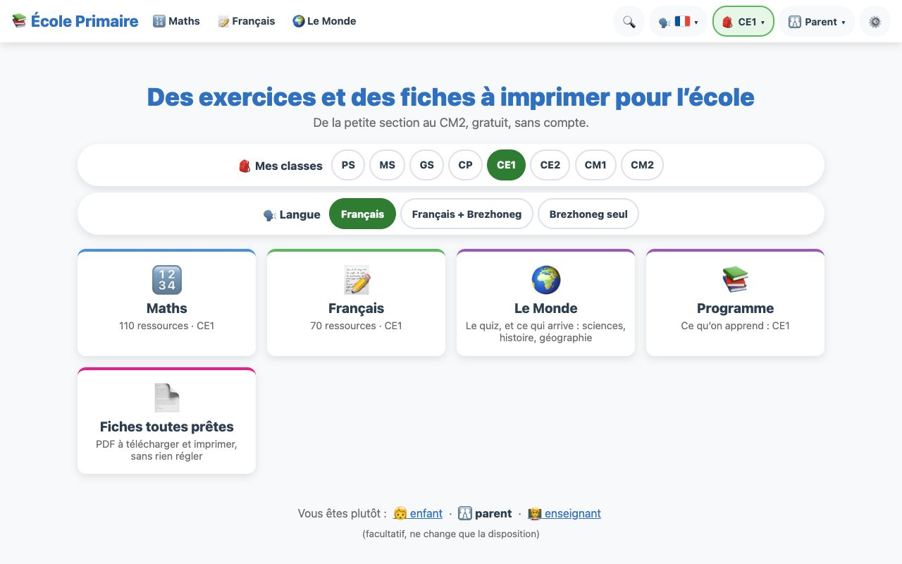
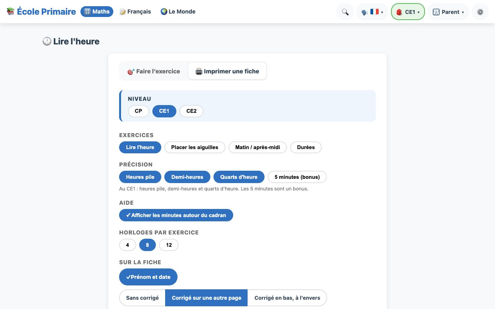
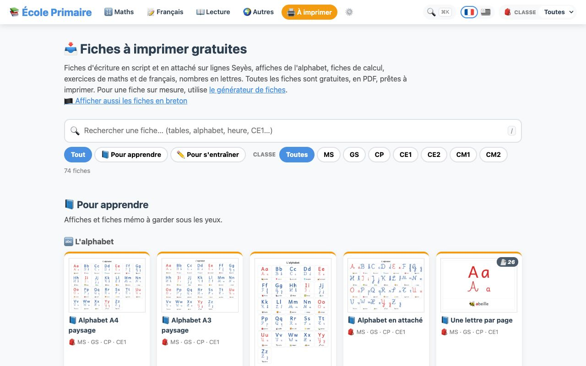

<p align="center">
  
</p>

<h1 align="center">École Primaire · Skoolik</h1>

<p align="center">
  Des exercices, des affiches et des fiches à imprimer pour l'école, de la PS au CM2, en français et en breton.<br>
  <a href="https://ecoleprimaire.app"><b>ecoleprimaire.app</b></a> · <a href="https://skoolik.app"><b>skoolik.app</b></a>
</p>

<p align="center">
  <a href="https://ecoleprimaire.app"></a>
  <a href="https://skoolik.app"></a>
  
  
  <br>
  
  
  
  <a href="LICENSE"></a>
  <a href="LICENCE-CONTENU.md"></a>
  <a href="LICENCE-CONTENU.md"></a>
  <br>
  
  
  
  <a href="https://github.com/iksaif/ecole-primaire/commits/main"></a>
  <a href="https://github.com/iksaif/ecole-primaire/issues"></a>
</p>

On a commencé ça pour nos enfants, pour réviser à la maison, et c'est devenu un petit site :

- **https://ecoleprimaire.app** — en français
- **https://skoolik.app** — la même chose en breton, pour les écoles bilingues et Diwan

Il y a des exercices à faire à l'écran (calcul mental, tables, heure, monnaie, lecture, dictée, grammaire,
conjugaison, quiz…), des affiches pour le mur de la classe (alphabet, nombres en lettres, jours, mois, météo,
horloge, tables…) et des fiches à imprimer : écriture sur lignes Seyès en script et en attaché, fiches de calcul
avec corrigé. Chaque exercice peut aussi sortir en fiche papier. Tout est rangé par matière, par domaine et par
compétence du programme ; le breton a sa propre page, de la maternelle au CE1.

<table>
  <tr>
    <td width="33%"><a href="https://ecoleprimaire.app"></a></td>
    <td width="33%"><a href="https://ecoleprimaire.app/maths/heure?mode=imprimer"></a></td>
    <td width="33%"><a href="https://ecoleprimaire.app/telechargements/"></a></td>
  </tr>
  <tr>
    <td align="center"><sub>Les exercices, par matière et par classe</sub></td>
    <td align="center"><sub>Chaque exercice se fait à l'écran ou s'imprime</sub></td>
    <td align="center"><sub>Plus de 600 fiches PDF toutes prêtes</sub></td>
  </tr>
</table>

On n'est pas enseignants. Les exercices suivent les programmes officiels en vigueur (BO de 2024 à 2026, cycles 1
à 3, et pour le breton le programme de langues vivantes et les repères de l'académie de Rennes) : leur texte est
dans `docs/programmes/`. Si une règle ou une réponse vous paraît fausse, dites-le nous.

## Vie privée

Tout tourne dans le navigateur. Il n'y a pas de compte, pas de publicité, pas de cookie, et aucune requête
vers un autre site que le nôtre.

- La langue, les réglages et les scores restent dans le stockage local du navigateur (`localStorage`).
  Rien n'est envoyé au serveur ; on peut tout effacer depuis les Paramètres.
- Pour savoir ce qui sert, l'app envoie à notre serveur un signal anonyme (page vue, fiche imprimée et ses
  réglages, langue) : pas de cookie, pas d'identifiant, et nginx l'enregistre **sans adresse IP**
  (`src/utils/journal.js`, `deploy/setup-nginx.sh`). Rien n'est envoyé si le navigateur demande à ne pas être
  suivi. `node scripts/deploiement/stats-vps.ts` en fait un résumé (pages vues, fiches imprimées, PDF téléchargés).
- Le serveur ne fait que servir des fichiers statiques. Comme tout serveur web, il garde des journaux
  techniques (IP, page demandée) quelque temps.
- Seule exception, facultative : si vous entrez votre propre clé API Mistral dans les réglages de la Dictée
  ou de la Lecture, ces exercices peuvent générer des phrases. La requête part alors directement de votre navigateur vers
  Mistral AI, avec votre clé. Sans clé, le site utilise ses phrases prédéfinies.

## À propos de l'IA

Ce site a été écrit en grande partie avec un assistant de programmation (Claude). Nous avons décidé ce qu'il
fallait faire, l'IA a écrit l'essentiel du code et des textes, et nous avons relu et testé le résultat. Le
contenu pédagogique a été vérifié contre les programmes officiels, dont les textes sont dans `docs/programmes/`.

Sans elle, on n'aurait jamais eu le temps de faire un site comme celui-ci : deux langues, de la PS au CM2, et
des centaines de fiches réglables. Ce serait mieux si tout était fait à la main, par des enseignants, des
illustrateurs et des brittophones. On a fait un autre choix : se servir de l'IA pendant le développement,
pour écrire du code libre qui produit ensuite les exercices et les fiches seul. Une fiche ne passe par aucune
IA et ne demande aucun serveur : elle est fabriquée dans votre navigateur. Rien n'est imposé sur les fiches :
pas de filigrane, pas de publicité, pas de marque.

Ce code est aussi une base : chaque exercice, chaque fiche et chaque affiche suit le même modèle, rangé par
compétence du programme. On peut donc en ajouter et en corriger facilement. Ce qui lui manque maintenant,
c'est le regard d'enseignants : avec eux, le contenu peut gagner en qualité et servir à beaucoup plus de
monde, dans d'autres classes et d'autres langues régionales. Si vous voulez y participer, même pour une
remarque, écrivez-nous (voir « Contribuer »).

Ce choix a des limites, et on préfère les dire :

- **Les modèles d'IA ont appris sur le travail d'autres personnes**, souvent sans leur accord, et leur coût en
  énergie est réel. On n'a pas de réponse à ça. On a seulement choisi de rendre tout le résultat libre et
  gratuit.
- **Le contenu peut contenir des erreurs.** On n'est pas enseignants ; signalez-nous ce qui vous paraît faux.
- **Le breton** : les nombres, l'alphabet, les jours et les mois ont été vérifiés dans le Wiktionnaire, le
  Meurgorf (dictionnaire de l'Office public de la langue bretonne) et Kervarker. Le reste de l'interface est
  une traduction automatique que des brittophones n'ont pas encore relue. Le site le signale aux visiteurs, et
  toute relecture, même partielle, est la bienvenue : les passages à relire sont marqués `// br: à relire`,
  et `npm run i18n:relecture` en fait un tableau.

Le site publié n'utilise pas d'IA, sauf si vous le demandez : la Dictée et la Lecture peuvent générer des
phrases avec votre propre clé Mistral (voir « Vie privée »).

Si vous préférez des ressources faites sans IA, on le comprend : il en existe beaucoup d'excellentes, souvent
partagées par des enseignants.

## Contribuer

Les retours sont les bienvenus, même sans écrire de code :

- une erreur, une faute, un bug : ouvrez une [issue](https://github.com/iksaif/ecole-primaire/issues)
  ou écrivez à contact@skoolik.app ;
- une idée d'exercice ou de fiche qui vous servirait en classe ou à la maison ;
- une relecture de la traduction bretonne, même partielle ;
- pour le code : les pull requests sont bienvenues, voir ci-dessous pour lancer le projet.

## Lancer le projet

Vue 3 + Vite, sans autre dépendance à l'exécution.

```sh
npm install
npm run dev               # http://localhost:5173/ecole-primaire/
npm run dev:skoolik       # la version bretonne
npm run build:app         # build de l'app seule (dist/)
npm test                  # tests de la base : node (sites, langues, définitions) + pages dans Chrome sans interface
npm run types             # vue-tsc strict (0 erreur)
npm run lint              # ESLint, règles de correction seulement (pas de règle de style)
npm run qualite           # compteurs qui ne doivent pas régresser (scripts/verifier/qualite-seuils.json)
npm run i18n              # vérifie que les traductions sont complètes
npm run couverture        # couverture du programme (couverture.html) : domaine × classe × compétence
```

Node 22 ou plus récent, et Google Chrome pour les tests. Les scripts (`scripts/`) sont rangés par rôle : voir `scripts/README.md`. La CI (`.github/workflows/tests.yml`) lance `lint`,
`types`, `qualite` et `npm test` sur chaque push et pull request vers `main`, et `npm run test:complet` chaque nuit.

### Organisation

Tout est en TypeScript. `AGENTS.md` décrit les règles du dépôt et où sont les choses.

- `src/sites.ts` — les sites (`ecoleprimaire`, `skoolik`), choisis par le mode Vite : identité, langues d'interface
  proposées et par défaut, langue régionale par défaut et proposées, contact, dépôt. `index.html` en tire son titre.
- `src/langues/` — le registre des langues (`registre.ts` : `LANGUES`, type `Langue`), un dossier par langue
  (`fr/`, `br/` : `index.ts`, `regles.ts`, `nombres.ts`, `drapeau.ts`, `donnees.ts` pour une langue régionale,
  `textes/`). Textes typés : le français est la source, les autres langues ont exactement les mêmes clés
  (`satisfies Traductions<…>`). `useLangue()` donne `t('section.cle', params)` ; `useLangueRegionale()`.
- `src/data/programme.ts` — les programmes officiels (domaines, compétences, contraintes de chaque classe, avec leurs
  sources) : il fait foi pour les niveaux.
- `src/noyau/` — le socle d'un exercice (`definir`, jeu, réglages, fiche, composants) ; `src/exercices/` — un dossier
  par exercice (définition, générateur et fiche purs, textes), registre `index.ts` ; `src/views/` — une vue mince par
  exercice ; `src/exercices/exemple/` est le modèle (`npm run nouveau`).
- `src/affiches/` — un dossier par affiche (définition, dessin pur, textes), registre `index.ts`, formulaire générique.
- `src/contexte/`, `src/router/`, `src/shell/`, `src/pages/` — classes, profil et mode de langue dans l'adresse ;
  routes ; en-tête, pied de page, visite guidée ; pages (accueil, matières, programme, fiches toutes prêtes, réglages…).
- `src/ressources/`, `src/telechargements/`, `src/recherche/`, `src/programme/` — le catalogue des ressources (rangé par
  domaine et par compétence), les fiches toutes prêtes, la recherche, la page Programme.

### Fiches PDF toutes prêtes

`npm run build:ecoleprimaire` et `npm run build:skoolik` construisent le site, puis lancent
`scripts/build/fiches/commande.ts` (PDF et vignettes, via Chrome sans interface avec playwright-core, et l'index
`fiches/index.json` + un JSON par fiche) et `scripts/build/statique/commande.ts` (une page HTML statique
`telechargements/<slug>/` par fiche, que les moteurs de recherche peuvent indexer, `sitemap.xml`,
`robots.txt`, page 404, JSON-LD). Chrome est cherché aux emplacements habituels, ou via `CHROME_PATH`.
`npm run fiches` et `npm run statique` lancent chaque étape seule.

Pour générer les PDF avec une police qu'on n'a pas le droit de redistribuer (Belle Allure, Écolier…),
déposez-la dans `polices-locales/attache/` : ce dossier n'est pas versionné. Vérifiez la licence avant
de publier les PDF.

### Sites et déploiement

Le même code donne les deux sites. Le mode Vite choisit le site (`.env.ecoleprimaire`, `.env.skoolik`,
`src/sites.ts`) : nom, adresse, langues par défaut, et langues des fiches publiées.

Le déploiement se fait par rsync sur un VPS :

```sh
cp .deploy.env.example .deploy.env   # hôte et dossiers (non versionné)
scripts/deploiement/deploy-vps.sh --dry-run      # ce qui serait envoyé
scripts/deploiement/deploy-vps.sh                # construit et envoie les deux sites
scripts/deploiement/deploy-vps.sh skoolik        # un seul site
```

`deploy/setup-nginx.sh` configure nginx (adresses propres, journal anonyme) et les certificats Let's Encrypt sur le
serveur (à lancer avec sudo).

GitHub Pages ne sert plus qu'une redirection vers https://ecoleprimaire.app, qui garde le chemin et la
route (`scripts/deploiement/redirection-gh-pages.mjs`, publiée à chaque push sur `main`).

## Polices

Toutes les polices utilisées sont livrées avec le site, sous licence libre :

- Playwrite FR Trad (écriture cursive scolaire), Andika (script, pensée pour l'apprentissage de la lecture)
  et OpenDyslexic, sous licence SIL OFL ;
- Luciole © Laurent Bourcellier & Jonathan Perez, sous licence CC BY 4.0.

Pour l'écriture attachée, on conseille [Belle Allure](https://www.jeanboyault.fr/belle-allure/) de Jean Boyault,
la cursive la plus utilisée en classe (ou [Écolier](https://www.dafont.com/fr/jean-marie-douteau.d75)). Leur licence
ne permet pas de les livrer avec le site : installez-les vous-même sur l'ordinateur (elles apparaissent alors dans le
choix de la police des fiches), ou ajoutez le fichier depuis ce choix ; il reste mémorisé dans le navigateur.

## Licence

- **Le code** est sous [GNU AGPL 3.0](LICENSE) (ou version ultérieure) : vous pouvez le reprendre, le
  modifier et héberger votre propre version, à condition de publier vos modifications sous la même licence,
  même si le site n'est utilisé qu'en ligne.
- **Les fiches et les PDF** sont sous [CC BY-NC-SA 4.0](LICENCE-CONTENU.md) : imprimez, photocopiez, distribuez et
  adaptez, en citant la source, sans usage commercial et en partageant vos versions sous la même licence.
- **Les textes et données sources** (lecture, dictée, listes de mots, quiz, traductions bretonnes) sont sous
  [CC BY-SA 4.0](LICENCE-CONTENU.md) : réutilisables, y compris dans un cadre commercial, en citant la source.
- **Les images** (emojis, pictogrammes) gardent la licence de leur auteur (détail dans [`LICENCE-CONTENU.md`](LICENCE-CONTENU.md)).

On a choisi ces licences pour que le site et ses améliorations restent libres et gratuits pour tout le
monde, en particulier les traductions dans les langues régionales.
